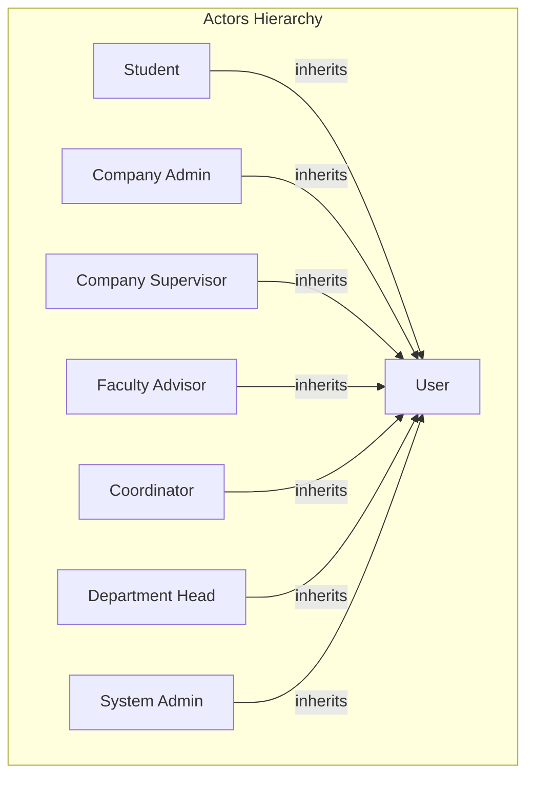

# Simplified ICMS USE CASE Diagram

## Overview

Redesign the USE CASE diagram to be cleaner and more readable by:

1. Using **actor generalization** (all actors inherit from a generic "User" actor)
2. Consolidating redundant CRUD operations into a single **"Manage"** use case per entity with role-specific descriptions
3. Removing duplicate connections and redundant use cases

## Current Issues with Existing Diagram

The current diagram in [`docs/diagrams/use-case-diagram.puml`](docs/diagrams/use-case-diagram.puml) has:

- Login/Logout/Profile repeated for 7 actors (21 redundant connections)
- Too many granular CRUD operations (Create/Edit/Delete shown separately)
- 60+ use cases making it hard to understand

## Proposed Architecture

## Simplified Use Case Structure

### 1. Common Use Cases (via User Actor)

Connected to the generalized "User" actor:

- **Login/Logout** - Authentication
- **Manage Profile** - Update personal information
- **View Notifications** - Real-time notifications
- **Chat** - Messaging functionality

### 2. Role-Specific Use Cases

| Actor | Primary Use Cases | "Manage" Description |

|-------|------------------|---------------------|

| **Student** | Browse Postings, Apply for Internship, Accept/Withdraw Application, View Forms, View Analytics | N/A - Consumer role |

| **Company Admin** | Manage (Supervisors, Postings, Applications), Assign Supervisor, View Analytics | CRUD on company resources |

| **Supervisor** | View Assigned Students, Approve Forms, Create Analytics, Manage Postings | CRUD on assigned interns' evaluations |

| **Faculty Advisor** | View Assigned Students, Manage Forms, Provide Feedback, View Analytics | CRUD on student forms |

| **Coordinator** | Manage Application Letters, Generate Letters, View Departments | CRUD on application letters |

| **Department Head** | Manage (Students, Advisors), Assign Advisors, View Statistics, View Analytics | CRUD on department users |

| **System Admin** | Manage (Users, Companies, Departments), Manage Homepage | Full system CRUD |

### 3. Key Design Decisions

1. **Actor Generalization**: Use UML generalization arrows to show all actors inherit common capabilities from "User"
2. **Consolidated "Manage" Use Cases**: Instead of separate Create/Edit/Delete use cases, use ONE "Manage X" use case per entity with a note describing what actions are included (CRUD)
3. **Role-Based Descriptions**: Add notes in the diagram indicating what each "Manage" use case means for each actor:

- Admin: Manages Users (Coordinators, Dept Heads, Company Admins)
- Dept Head: Manages Students and Advisors in their department
- Company Admin: Manages Supervisors and Postings for their company

4. **Include/Extend Relationships**: Use sparingly for truly dependent use cases:

- Apply for Internship <<include>> Browse Postings
- Generate Letters <<include>> Manage Application Letters

## Output File

Create/update: [`docs/diagrams/class-diagram.drawio`](docs/diagrams/class-diagram.drawio) - Actually, we'll create a new file: `docs/diagrams/use-case-diagram.drawio`

## Diagram Elements Summary

- **8 Actors**: 1 generalized (User) + 7 specific roles
- **~15-20 Use Cases** (down from 60+)
- **Clean generalization hierarchy**